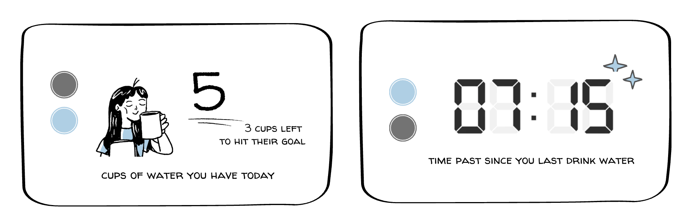
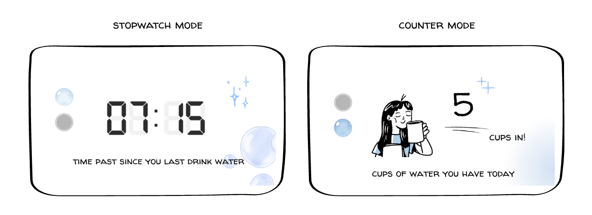
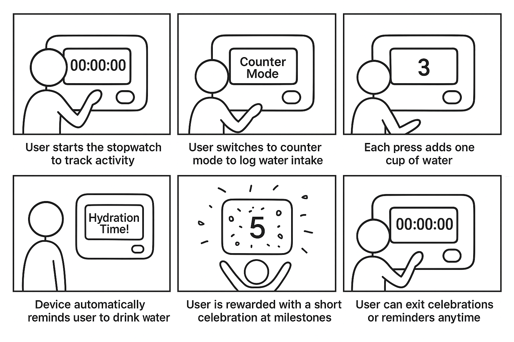

# Interactive Prototyping: The Clock of Pi
**NAMES OF COLLABORATORS HERE**

Does it feel like time is moving strangely during this semester?

For our first Pi project, we will pay homage to the [timekeeping devices of old](https://en.wikipedia.org/wiki/History_of_timekeeping_devices) by making simple clocks.

It is worth spending a little time thinking about how you mark time, and what would be useful in a clock of your own design.

**Please indicate anyone you collaborated with on this Lab here.**
Be generous in acknowledging their contributions! And also recognizing any other influences (e.g. from YouTube, Github, Twitter) that informed your design. 

## Prep

Lab Prep is extra long this week. Make sure to start this early for lab on Thursday.

1. ### Set up your Lab 2 Github

Before the start of lab Thursday, ensure you have the latest lab content by updating your forked repository. 

**📖 [Follow the step-by-step guide for safely updating your fork](pull_updates/README.md)**

This guide covers how to pull updates without overwriting your completed work, handle merge conflicts, and recover if something goes wrong.


2. ### Get Kit and Inventory Parts
Prior to the lab session on Thursday, taken inventory of the kit parts that you have, and note anything that is missing:

***Update your [parts list inventory](partslist.md)***

3. ### Prepare your Pi for lab this week
[Follow these instructions](prep.md) to download and burn the image for your Raspberry Pi before lab Thursday.


## Overview
For this assignment, you are going to 

A) [Connect to your Pi](#part-a)  

B) [Try out cli_clock.py](#part-b) 

C) [Set up your RGB display](#part-c)

D) [Try out clock_display_demo](#part-d) 

E) [Modify the code to make the display your own](#part-e)

F) [Make a short video of your modified barebones PiClock](#part-f)

G) [Sketch and brainstorm further interactions and features you would like for your clock for Part 2.](#part-g)

## The Report
This readme.md page in your own repository should be edited to include the work you have done. You can delete everything but the headers and the sections between the \*\*\***stars**\*\*\*. Write the answers to the questions under the starred sentences. Include any material that explains what you did in this lab hub folder, and link it in the readme.

Labs are due on Mondays. Make sure this page is linked to on your main class hub page.

## Part A. 
### Connect to your Pi
Just like you did in the lab prep, ssh on to your pi. Once you get there, create a Python environment (named venv) by typing the following commands.

```
ssh pi@<your Pi's IP address>
...
pi@raspberrypi:~ $ python -m venv venv
pi@raspberrypi:~ $ source venv/bin/activate
(venv) pi@raspberrypi:~ $ 

```
### Setup Personal Access Tokens on GitHub
Set your git name and email so that commits appear under your name.
```
git config --global user.name "Your Name"
git config --global user.email "yourNetID@cornell.edu"
```

The support for password authentication of GitHub was removed on August 13, 2021. That is, in order to link and sync your own lab-hub repo with your Pi, you will have to set up a "Personal Access Tokens" to act as the password for your GitHub account on your Pi when using git command, such as `git clone` and `git push`.

Following the steps listed [here](https://docs.github.com/en/authentication/keeping-your-account-and-data-secure/managing-your-personal-access-tokens) from GitHub to set up a token. Depends on your preference, you can set up and select the scopes, or permissions, you would like to grant the token. This token will act as your GitHub password later when you use the terminal on your Pi to sync files with your lab-hub repo.


## Part B. 
### Try out the Command Line Clock
Clone your own lab-hub repo for this assignment to your Pi and change the directory to Lab 2 folder (remember to replace the following command line with your own GitHub ID):

```
(venv) pi@raspberrypi:~$ git clone https://github.com/<YOURGITID>/Interactive-Lab-Hub.git
(venv) pi@raspberrypi:~$ cd Interactive-Lab-Hub/Lab\ 2/
```
Depends on the setting, you might be asked to provide your GitHub user name and password. Remember to use the "Personal Access Tokens" you just set up as the password instead of your account one!

Check if the directory has clone sucessfully, you should see the Interactive-Lab-Hub under the home directory listed:
```
(venv) pi@raspberrypi:~ $ ls
Bookshelf      Documents            Music     Public                 venv
create_img.sh  Downloads            pi-apps   screen_boot_script.py  Videos
Desktop        Interactive-Lab-Hub  Pictures  Templates
(venv) pi@raspberrypi:~ $
```


Install the packages from the requirements.txt and run the example script `cli_clock.py`:

```
(venv) pi@raspberrypi:~/Interactive-Lab-Hub/Lab 2 $ pip install -r requirements.txt
(venv) pi@raspberrypi:~/Interactive-Lab-Hub/Lab 2 $ python cli_clock.py 
02/24/2021 11:20:49
```

The terminal should show the time, you can press `ctrl-c` to exit the script.
If you are unfamiliar with the Python code in `cli_clock.py`, have a look at [this Python refresher](https://hackernoon.com/intermediate-python-refresher-tutorial-project-ideas-and-tips-i28s320p). If you are still concerned, please reach out to the teaching staff!


## Part C. 
### Set up your RGB Display
We have asked you to equip the [Adafruit MiniPiTFT](https://www.adafruit.com/product/4393) on your Pi in the Lab 2 prep already. Here, we will introduce you to the MiniPiTFT and Python scripts on the Pi with more details.


The Raspberry Pi 4 has a variety of interfacing options. When you plug the pi in the red power LED turns on. Any time the SD card is accessed the green LED flashes. It has standard USB ports and HDMI ports. Less familiar it has a set of 20x2 pin headers that allow you to connect a various peripherals.


To learn more about any individual pin and what it is for go to [pinout.xyz](https://pinout.xyz/pinout/3v3_power) and click on the pin. Some terms may be unfamiliar but we will go over the relevant ones as they come up.

### Hardware (you have already done this in the prep)

From your kit take out the display and the [Raspberry Pi 5](https://www.google.com/url?sa=i&url=https%3A%2F%2Fwww.raspberrypi.com%2Fproducts%2Fraspberry-pi-5%2F&psig=AOvVaw330s4wIQWfHou2Vk3-0jUN&ust=1757611779758000&source=images&cd=vfe&opi=89978449&ved=0CBMQjRxqFwoTCPi1-5_czo8DFQAAAAAdAAAAABAE)

Line up the screen and press it on the headers. The hole in the screen should match up with the hole on the raspberry pi.

<p float="left">


</p>

### Testing your Screen

The display uses a communication protocol called [SPI](https://www.circuitbasics.com/basics-of-the-spi-communication-protocol/) to speak with the raspberry pi. We won't go in depth in this course over how SPI works. The port on the bottom of the display connects to the SDA and SCL pins used for the I2C communication protocol which we will cover later. GPIO (General Purpose Input/Output) pins 23 and 24 are connected to the two buttons on the left. GPIO 22 controls the display backlight.

To show you the IP and Mac address of the Pi to allow connecting remotely we created a service that launches a python script that runs on boot. For the following steps stop the service by typing ``` sudo systemctl stop piscreen.service --now```. Othwerise two scripts will try to use the screen at once. You may start it again by typing ``` sudo systemctl start piscreen.service --now```

We can test it by typing 
```
(venv) pi@raspberrypi:~/Interactive-Lab-Hub/Lab 2 $ python screen_test.py
```

You can type the name of a color then press either of the buttons on the MiniPiTFT to see what happens on the display! You can press `ctrl-c` to exit the script. Take a look at the code with
```
(venv) pi@raspberrypi:~/Interactive-Lab-Hub/Lab 2 $ cat screen_test.py
```

#### Displaying Info with Texts
You can look in `screen_boot_script.py` for how to display text on the screen!

#### Displaying an image

You can look in `image.py` for an example of how to display an image on the screen. Can you make it switch to another image when you push one of the buttons?


## Part D. 
### Set up the Display Clock Demo
Work on `screen_clock.py`, try to show the time by filling in the while loop (at the bottom of the script where we noted "TODO" for you). You can use the code in `cli_clock.py` and `stats.py` to figure this out.

### How to Edit Scripts on Pi
Option 1. One of the ways for you to edit scripts on Pi through terminal is using [`nano`](https://linuxize.com/post/how-to-use-nano-text-editor/) command. You can go into the `screen_clock.py` by typing the follow command line:
```
(venv) pi@raspberrypi:~/Interactive-Lab-Hub/Lab 2 $ nano screen_clock.py
```
You can make changes to the script this way, remember to save the changes by pressing `ctrl-o` and press enter again. You can press `ctrl-x` to exit the nano mode. There are more options listed down in the terminal you can use in nano.

Option 2. Another way for you to edit scripts is to use VNC on your laptop to remotely connect your Pi. Try to open the files directly like what you will do with your laptop and edit them. Since the default OS we have for you does not come up a python programmer, you will have to install one yourself otherwise you will have to edit the codes with text editor. [Thonny IDE](https://thonny.org/) is a good option for you to install, try run the following command lines in your Pi's ternimal:

  ```
  pi@raspberrypi:~ $ sudo apt install thonny
  pi@raspberrypi:~ $ sudo apt update && sudo apt upgrade -y
  ```

Now you should be able to edit python scripts with Thonny on your Pi.

Option 3. A nowadays often preferred method is to use Microsoft [VS code to remote connect to the Pi](https://www.raspberrypi.com/news/coding-on-raspberry-pi-remotely-with-visual-studio-code/). This gives you access to a fullly equipped and responsive code editor with terminal and file browser.  

Pro Tip: Using tools like [code-server](https://coder.com/docs/code-server/latest) you can even setup a VS Code coding environment hosted on your raspberry pi and code through a web browser on your tablet or smartphone! 

## Part E. Now moved to Lab2 Part 2.

## Part F. Now moved to Lab2 Part 2.

## Part G. 
## Sketch and brainstorm further interactions and features you would like for your clock for Part 2.

- Idea 1 

This is a hydration-aware clock. This functions not like a traditional clock, but more like a reverse timer that resets when you hydrate. In other words, rather than counting down minutes or hours of the day, this clock shows how much time has passed since you last drank water. When the user take a drink, a simple interaction with the device (like tapping a button) resets the timer, and the display returns to baseline.

Some of the possible features include :
- water intake counter, hydration progress tracker
- visual metaphor (a droplet evaporating or a desert landscape drying out)
- optional goal indicator (example: 8 cups per day)
- sound (soft water-drop sounds or chimes after a long hydration gap) or visual cue (gentle screen glow or pulsing animation) if it’s been too long.
  
Another advance feature I have in mind is to adjust the hydration goal with weather information. For example, on hot days, the device could subtly increase reminders or adjust daily goals. If it's possible, the device should also have dark/light mode for energy and eye comfort.

(graphics are made with Canva)

# Prep for Part 2

1. Pick up remaining parts for kit on Thursday lab class. Check the updated [parts list inventory](partslist.md) and let the TA know if there is any part missing.
2. Look at and give feedback on the Part G. for at least 2 other people in the class (and get 2 people to comment on your Part G!)

# Lab 2 Part 2

## Assignment that was formerly Lab 2 Part E.
### Modify the barebones clock to make it your own

Does time have to be linear?  How do you measure a year? [In daylights? In midnights? In cups of coffee?](https://www.youtube.com/watch?v=wsj15wPpjLY)

Can you make time interactive? You can look in `screen_test.py` for examples for how to use the buttons.

Please sketch/diagram your clock idea. (Try using a [Verplank diagram](https://ccrma.stanford.edu/courses/250a-fall-2004/IDSketchbok.pdf))!

**We strongly discourage and will reject the results of literal digital or analog clock display.**


\*\*\***A copy of your code should be in your Lab 2 Github repo.**\*\*\*


## Assignment that was formerly Part F. 
## Make a short video of your modified barebones PiClock

\*\*\***Take a video of your PiClock.**\*\*\*

After you edit and work on the scripts for Lab 2, the files should be upload back to your own GitHub repo! You can push to your personal github repo by adding the files here, commiting and pushing.

```
(venv) pi@raspberrypi:~/Interactive-Lab-Hub/Lab 2 $ git add .
(venv) pi@raspberrypi:~/Interactive-Lab-Hub/Lab 2 $ git commit -m 'your commit message here'
(venv) pi@raspberrypi:~/Interactive-Lab-Hub/Lab 2 $ git push
```

After that, Git will ask you to login to your GitHub account to push the updates online, you will be asked to provide your GitHub user name and password. Remember to use the "Personal Access Tokens" you set up in Part A as the password instead of your account one! Go on your GitHub repo with your laptop, you should be able to see the updated files from your Pi!


[Update your Lab Hub](pull_updates/README.md) to get the latest content and requirements for Part 2.

Modify the code from last week's lab to make a new visual interface for your new clock. You may [extend the Pi](Extending%20the%20Pi.md) by adding sensors or buttons, but this is not required.

- The final device sktech is as following : 

(cr: graphics from Canva)

I hope this device allows user to use this clock flexibily, so that they are aren’t locked into one function : they can switch between stopwatch and counter without losing progress. To give user more control over their experience in using the device, users can skip celebrations or reminders if they want by simply long press assigned buttons. 

The following story board is to depict how users can interact with this device : 


- 1. `stopwatch mode` : This mode lets users easily track time with a stopwatch that shows hours, minutes, and seconds, with simple controls to start, pause, or reset. While timing, users can seamlessly switch to another mode at any moment (counter mode). Based on feedback from user testing, a hydration reminder was added after 5 minutes of activity, the device automatically displays a scrolling ‘Hydration time!’ message. This ensures users are gently reminded to drink water, and they can continue in either stopwatch or counter mode once acknowledged.

- 2. `counter mode` : This mode helps users track the number of cups of water they drink. With each press of Button A, the count increases by one. When I asked my roomates to use the device, one concern they raised is that user may lose motivation. Therefore, the celebration feature was added to reward progress and encourage continue drinking water. In order to make this hydration tracking more engaging, a bubble/confetti celebration appears for ~4 seconds whenever users hit milestones (5, 10, 15…). Users can exit the celebration at any time and return to the normal counter display. 

- These are the link to the video :
  - link 1 (stopwactch mode, counter mode & celebration): https://drive.google.com/file/d/1nkph9NilkDPLut_DveHWeBRRzwOdA7tm/view?usp=sharing
  - link 2 (hydration reminder): https://drive.google.com/file/d/1PNAduc30-kr_18eO4fQNwGMyJReDBWcc/view?usp=sharing
    
- This is a table summarizing how the users can interact with the clock : 

| **Mode**                           | **Button / Trigger** | **Press Type**    | **Action / Effect**                                                       |
| ---------------------------------- | -------------------- | ----------------- | ------------------------------------------------------------------------- |
| **Stopwatch**                      | A                    | Short press       | Start / pause stopwatch                                                   |
| **Stopwatch**                      | B                    | Short press       | Switch to Counter mode                                                    |
| **Stopwatch**                      | B                    | Long press        | Reset stopwatch (`elapsed = 0`, stop running)                             |
| **Stopwatch**                      | —                    | Auto trigger      | Hydration reminder: scrolling `"Hydration time!"` appears after 5 minutes |
| **Stopwatch / Hydration Reminder** | B                    | Long press / stop | Exit hydration reminder and return to Stopwatch mode                      |
| **Counter**                        | A                    | Short press       | Increment `cup_count` by 1                                                |
| **Counter**                        | B                    | Short press       | Switch to Stopwatch mode                                                  |
| **Counter**                        | —                    | Auto trigger      | Celebration: confetti/bubbles when `cup_count` reaches multiples of 5     |
| **Counter / Celebration**          | A                    | Long press / exit | Exit celebration overlay and return to Counter display                    |


