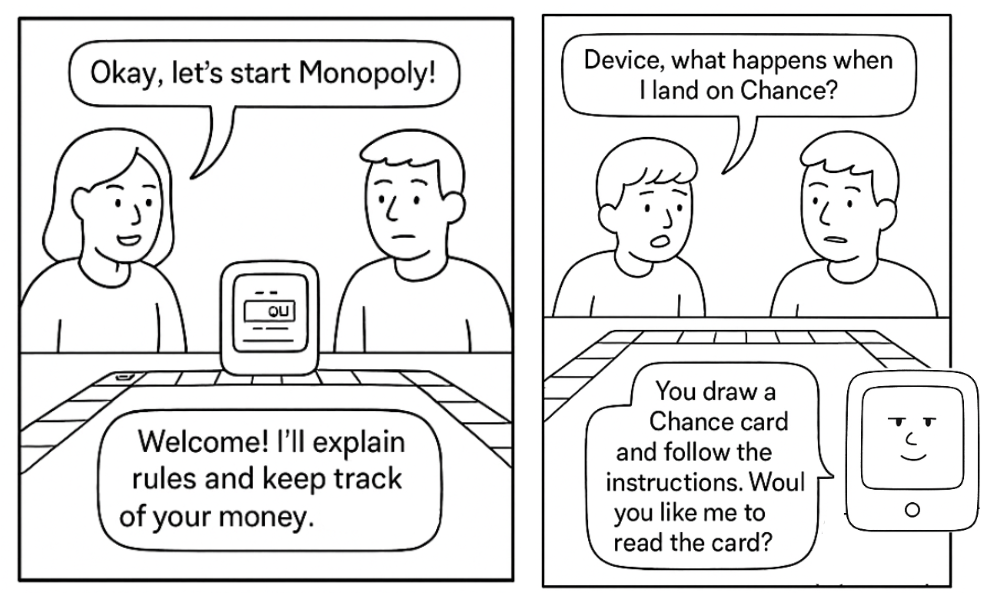
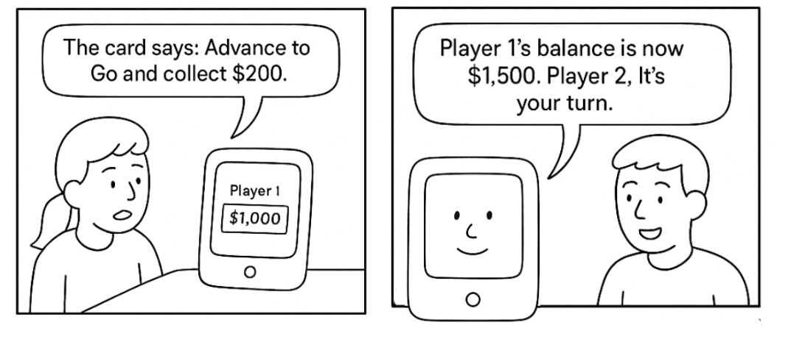
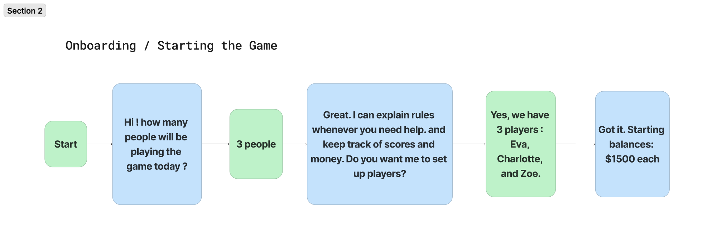
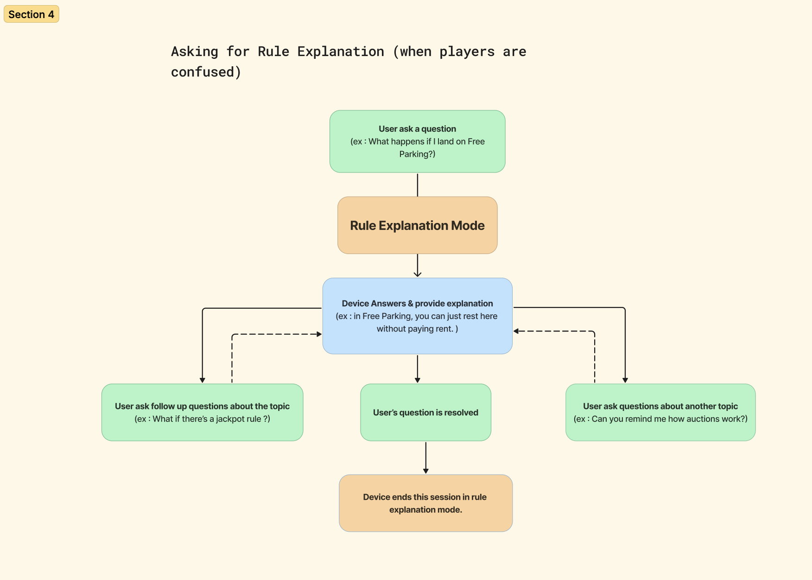
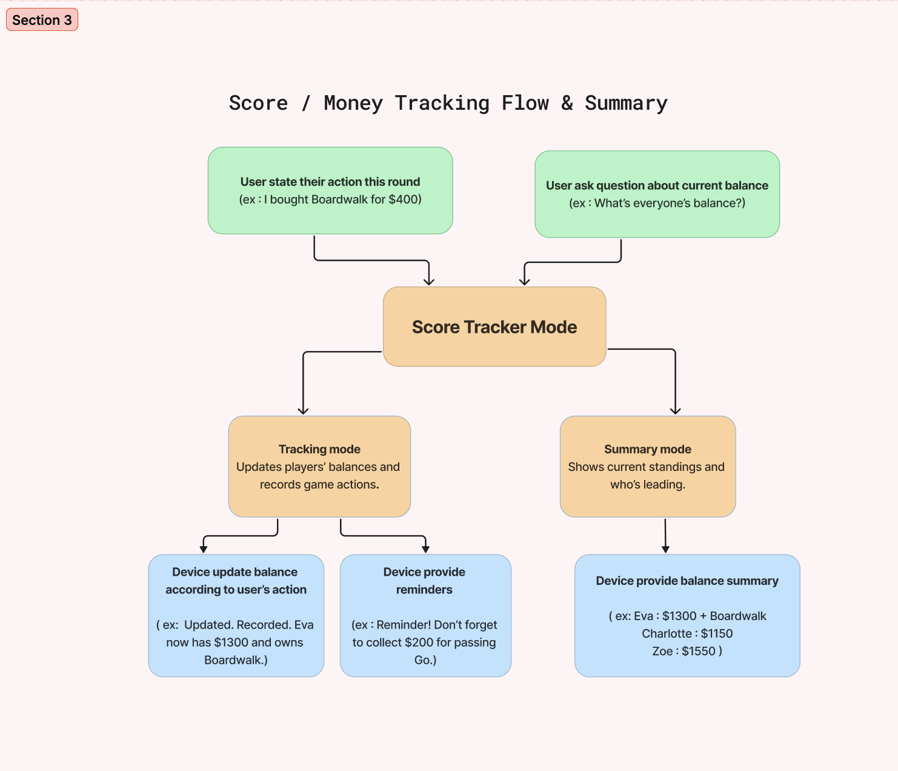

# Chatterboxes
**NAMES OF COLLABORATORS HERE** : Charlotte Lin, Eva Huang (we brainstormed together and help each other with filming the videos but developed on our own)

In this lab, we want you to design interaction with a speech-enabled device--something that listens and talks to you. This device can do anything *but* control lights (since we already did that in Lab 1).  First, we want you first to storyboard what you imagine the conversational interaction to be like. Then, you will use wizarding techniques to elicit examples of what people might say, ask, or respond.  We then want you to use the examples collected from at least two other people to inform the redesign of the device.

We will focus on **audio** as the main modality for interaction to start; these general techniques can be extended to **video**, **haptics** or other interactive mechanisms in the second part of the Lab.

<details>
  <summary><strong>  Prep for Part 1: Get the Latest Content and Pick up Additional Parts  (Click to Expand)</strong></summary>
Please check instructions in [prep.md](prep.md) and complete the setup before class on Wednesday, Sept 23rd.

### Pick up Web Camera If You Don't Have One

Students who have not already received a web camera will receive their [Logitech C270 Webcam](https://www.amazon.com/Logitech-Desktop-Widescreen-Calling-Recording/dp/B004FHO5Y6/ref=sr_1_3?crid=W5QN79TK8JM7&dib=eyJ2IjoiMSJ9.FB-davgIQ_ciWNvY6RK4yckjgOCrvOWOGAG4IFaH0fczv-OIDHpR7rVTU8xj1iIbn_Aiowl9xMdeQxceQ6AT0Z8Rr5ZP1RocU6X8QSbkeJ4Zs5TYqa4a3C_cnfhZ7_ViooQU20IWibZqkBroF2Hja2xZXoTqZFI8e5YnF_2C0Bn7vtBGpapOYIGCeQoXqnV81r2HypQNUzFQbGPh7VqjqDbzmUoloFA2-QPLa5lOctA.L5ztl0wO7LqzxrIqDku9f96L9QrzYCMftU_YeTEJpGA&dib_tag=se&keywords=webcam%2Bc270&qid=1758416854&sprefix=webcam%2Bc270%2Caps%2C125&sr=8-3&th=1) and bluetooth speaker on Wednesday at the beginning of lab. If you cannot make it to class this week, please contact the TAs to ensure you get these. 

### Get the Latest Content

As always, pull updates from the class Interactive-Lab-Hub to both your Pi and your own GitHub repo. There are 2 ways you can do so:

**\[recommended\]**Option 1: On the Pi, `cd` to your `Interactive-Lab-Hub`, pull the updates from upstream (class lab-hub) and push the updates back to your own GitHub repo. You will need the *personal access token* for this.

```
pi@ixe00:~$ cd Interactive-Lab-Hub
pi@ixe00:~/Interactive-Lab-Hub $ git pull upstream Fall2025
pi@ixe00:~/Interactive-Lab-Hub $ git add .
pi@ixe00:~/Interactive-Lab-Hub $ git commit -m "get lab3 updates"
pi@ixe00:~/Interactive-Lab-Hub $ git push
```

Option 2: On your your own GitHub repo, [create pull request](https://github.com/FAR-Lab/Developing-and-Designing-Interactive-Devices/blob/2022Fall/readings/Submitting%20Labs.md) to get updates from the class Interactive-Lab-Hub. After you have latest updates online, go on your Pi, `cd` to your `Interactive-Lab-Hub` and use `git pull` to get updates from your own GitHub repo.

## Part 1.
### Setup 

Activate your virtual environment

```
pi@ixe00:~$ cd Interactive-Lab-Hub
pi@ixe00:~/Interactive-Lab-Hub $ cd Lab\ 3
pi@ixe00:~/Interactive-Lab-Hub/Lab 3 $ python3 -m venv .venv
pi@ixe00:~/Interactive-Lab-Hub $ source .venv/bin/activate
(.venv)pi@ixe00:~/Interactive-Lab-Hub $ 
```

Run the setup script
```(.venv)pi@ixe00:~/Interactive-Lab-Hub $ pip install -r requirements.txt  ```

Next, run the setup script to install additional text-to-speech dependencies:
```
(.venv)pi@ixe00:~/Interactive-Lab-Hub/Lab 3 $ ./setup.sh
```
</details>


<details>
  <summary><strong>  🔊 Text to Speech  (Click to Expand)</strong></summary>

In this part of lab, we are going to start peeking into the world of audio on your Pi! 

We will be using the microphone and speaker on your webcamera. In the directory is a folder called `speech-scripts` containing several shell scripts. `cd` to the folder and list out all the files by `ls`:

```
pi@ixe00:~/speech-scripts $ ls
Download        festival_demo.sh  GoogleTTS_demo.sh  pico2text_demo.sh
espeak_demo.sh  flite_demo.sh     lookdave.wav
```

You can run these shell files `.sh` by typing `./filename`, for example, typing `./espeak_demo.sh` and see what happens. Take some time to look at each script and see how it works. You can see a script by typing `cat filename`. For instance:

```
pi@ixe00:~/speech-scripts $ cat festival_demo.sh 
#from: https://elinux.org/RPi_Text_to_Speech_(Speech_Synthesis)#Festival_Text_to_Speech
```
You can test the commands by running
```
echo "Just what do you think you're doing, Dave?" | festival --tts
```

Now, you might wonder what exactly is a `.sh` file? 
Typically, a `.sh` file is a shell script which you can execute in a terminal. The example files we offer here are for you to figure out the ways to play with audio on your Pi!

You can also play audio files directly with `aplay filename`. Try typing `aplay lookdave.wav`.


---
Bonus:
[Piper](https://github.com/rhasspy/piper) is another fast neural based text to speech package for raspberry pi which can be installed easily through python with:
```
pip install piper-tts
```
and used from the command line. Running the command below the first time will download the model, concurrent runs will be faster. 
```
echo 'Welcome to the world of speech synthesis!' | piper \
  --model en_US-lessac-medium \
  --output_file welcome.wav
```
Check the file that was created by running `aplay welcome.wav`. Many more languages are supported and audio can be streamed dirctly to an audio output, rather than into an file by:

```
echo 'This sentence is spoken first. This sentence is synthesized while the first sentence is spoken.' | \
  piper --model en_US-lessac-medium --output-raw | \
  aplay -r 22050 -f S16_LE -t raw -
```
</details>
  
\*\***Write your own shell file to use your favorite of these TTS engines to have your Pi greet you by name.**\*\*
(This shell file should be saved to your own repo for this lab.)
-  please refer to `greet.sh` in speech-scripts folder


<details>
  <summary><strong> 💬 Speech to Text (Click to Expand)</strong></summary>


Next setup speech to text. We are using a speech recognition engine, [Vosk](https://alphacephei.com/vosk/), which is made by researchers at Carnegie Mellon University. Vosk is amazing because it is an offline speech recognition engine; that is, all the processing for the speech recognition is happening onboard the Raspberry Pi. 

Make sure you're running in your virtual environment with the dependencies already installed:
```
source .venv/bin/activate
```

Test if vosk works by transcribing text:

```
vosk-transcriber -i recorded_mono.wav -o test.txt
```

You can use vosk with the microphone by running 
```
python test_microphone.py -m en
```

---
Bonus:
[Whisper](https://openai.com/index/whisper/) is a neural network–based speech-to-text (STT) model developed and open-sourced by OpenAI. Compared to Vosk, Whisper generally achieves higher accuracy, particularly on noisy audio and diverse accents. It is available in multiple model sizes; for edge devices such as the Raspberry Pi 5 used in this class, the tiny.en model runs with reasonable latency even without a GPU.

By contrast, Vosk is more lightweight and optimized for running efficiently on low-power devices like the Raspberry Pi. The choice between Whisper and Vosk depends on your scenario: if you need higher accuracy and can afford slightly more compute, Whisper is preferable; if your priority is minimal resource usage, Vosk may be a better fit.

In this class, we provide two Whisper options: A quantized 8-bit faster-whisper model for speed, and the standard Whisper model. Try them out and compare the trade-offs.

Make sure you're in the Lab 3 directory with your virtual environment activated:
```
cd ~/Interactive-Lab-Hub/Lab\ 3/speech-scripts
source ../.venv/bin/activate
```

Then test the Whisper models:
```
python whisper_try.py
```
and

```
python faster_whisper_try.py
```
</details>

\*\***Write your own shell file that verbally asks for a numerical based input (such as a phone number, zipcode, number of pets, etc) and records the answer the respondent provides.**\*\*
-  please refer to `ask_number.sh` in speech-scripts folder

<details>
  <summary><strong> 🤖 NEW: AI-Powered Conversations with Ollama (Click to Expand)</strong></summary>

Want to add intelligent conversation capabilities to your voice projects? **Ollama** lets you run AI models locally on your Raspberry Pi for sophisticated dialogue without requiring internet connectivity!

#### Quick Start with Ollama

**Installation** (takes ~5 minutes):
```bash
# Install Ollama
curl -fsSL https://ollama.com/install.sh | sh

# Download recommended model for Pi 5
ollama pull phi3:mini

# Install system dependencies for audio (required for pyaudio)
sudo apt-get update
sudo apt-get install -y portaudio19-dev python3-dev

# Create separate virtual environment for Ollama (due to pyaudio conflicts)
cd ollama/
python3 -m venv ollama_venv
source ollama_venv/bin/activate

# Install Python dependencies in separate environment
pip install -r ollama_requirements.txt
```
#### Ready-to-Use Scripts

We've created three Ollama integration scripts for different use cases:

**1. Basic Demo** - Learn how Ollama works:
```bash
python3 ollama_demo.py
```

**2. Voice Assistant** - Full speech-to-text + AI + text-to-speech:
```bash
python3 ollama_voice_assistant.py
```

**3. Web Interface** - Beautiful web-based chat with voice options:
```bash
python3 ollama_web_app.py
# Then open: http://localhost:5000
```

#### Integration in Your Projects

Simple example to add AI to any project:
```python
import requests

def ask_ai(question):
    response = requests.post(
        "http://localhost:11434/api/generate",
        json={"model": "phi3:mini", "prompt": question, "stream": False}
    )
    return response.json().get('response', 'No response')

# Use it anywhere!
answer = ask_ai("How should I greet users?")
```

**📖 Complete Setup Guide**: See `OLLAMA_SETUP.md` for detailed instructions, troubleshooting, and advanced usage!

\*\***Try creating a simple voice interaction that combines speech recognition, Ollama processing, and text-to-speech output. Document what you built and how users responded to it.**\*\*

### Serving Pages

In Lab 1, we served a webpage with flask. In this lab, you may find it useful to serve a webpage for the controller on a remote device. Here is a simple example of a webserver.

```
pi@ixe00:~/Interactive-Lab-Hub/Lab 3 $ python server.py
 * Serving Flask app "server" (lazy loading)
 * Environment: production
   WARNING: This is a development server. Do not use it in a production deployment.
   Use a production WSGI server instead.
 * Debug mode: on
 * Running on http://0.0.0.0:5000/ (Press CTRL+C to quit)
 * Restarting with stat
 * Debugger is active!
 * Debugger PIN: 162-573-883
```
From a remote browser on the same network, check to make sure your webserver is working by going to `http://<YourPiIPAddress>:5000`. You should be able to see "Hello World" on the webpage.
</details>

### Storyboard

Storyboard and/or use a Verplank diagram to design a speech-enabled device. (Stuck? Make a device that talks for dogs. If that is too stupid, find an application that is better than that.) 

\*\***Post your storyboard and diagram here.**\*\*



Write out what you imagine the dialogue to be. Use cards, post-its, or whatever method helps you develop alternatives or group responses. 

\*\***Please describe and document your process.**\*\*

- I designed the conversation workflow by breaking down how players naturally interact with both the game and each other. The first thought in designing the device and its conversation flow was to make sure the device can be like an assistant that feels like part of the table. Instead of letting the users feel that the device is a rulebook or just a scorekeeper, I tried to design the conversation in a way that it can flow based on the interactions with the users (mainly the speech input from user) while keeping the game engaging. 

- The flow begins with `Onboarding`, where the device sets up players and starting balances. During gameplay, players can enter the `Rule Explanation` flow whenever they are confused. This is mainly to help the players continue the game more smoothly without consulting manuals. The `Score & Money Tracking Flow` manages updates of balances and transactions so players don’t have to track them manually. In this mode, there is also the `Game Summary` feature which the device provides quick overviews of the current standings, making it easy to see who is leading. 

- In each of the flow chart below, **green box represents the user, blue box represent the device, and the orange box indicate the settings / features of the device.**

- `Onboarding / Starting the Game`: The device sets up the game by identifying the players, initializing balances, and preparing to assist during play.


- `Asking for Rule Explanation`: Players ask the device about unclear rules, and it provides quick, accurate clarifications.


- `Score Tracking & Game Summary` : The device records in-game actions (like passing Go, paying rent, or buying properties) and updates players’ balances. In the summary mode, the device provides a snapshot of the current game state, showing balances, property ownership, and who is leading.


- Here's the link to Figma (which I used to create the flow chart) : [Link to figma board](https://www.figma.com/board/QSjo9tSrzV6DxOiC4RmsFJ/IDD-lab3_pt1_flow?node-id=0-1&t=BxyXoOAZD8CCBanm-1)

### Acting out the dialogue

Find a partner, and *without sharing the script with your partner* try out the dialogue you've designed, where you (as the device designer) act as the device you are designing.  Please record this interaction (for example, using Zoom's record feature).

We worked together to act out and test out the dialouges
- Ideabox https://youtu.be/8xRIaNbEIwg
- Warewolves https://youtu.be/oKx95uURB4s
- Rules explain https://drive.google.com/file/d/10ByKoQw41XVuMDyUWIKn8qw_uJNr9zi4/view?usp=drive_link

- One of the biggest differences between the planned design and the actual acted-out dialogue is the timing. During the live interaction, users often spoke faster. It is also possible that the responded spoke before the assistant finished speaking. Real-time pacing and turn-taking are much harder to manage in practice than in scripted dialogues. In addition, without additional feedback or instruction provided by the device, sometimes it's hard for the users to understand how they can interact with the device or what is the result of their interaction with the device. 

<details>
  <summary><strong> Wizarding with the Pi (optional)(Click to Expand)</strong></summary>
  
In the [demo directory](./demo), you will find an example Wizard of Oz project. In that project, you can see how audio and sensor data is streamed from the Pi to a wizard controller that runs in the browser.  You may use this demo code as a template. By running the `app.py` script, you can see how audio and sensor data (Adafruit MPU-6050 6-DoF Accel and Gyro Sensor) is streamed from the Pi to a wizard controller that runs in the browser `http://<YouPiIPAddress>:5000`. You can control what the system says from the controller as well!
</details>


# Lab 3 Part 2

For Part 2, you will redesign the interaction with the speech-enabled device using the data collected, as well as feedback from part 1.

## Prep for Part 2

1. What are concrete things that could use improvement in the design of your device? For example: wording, timing, anticipation of misunderstandings...
2. What are other modes of interaction _beyond speech_ that you might also use to clarify how to interact?
3. Make a new storyboard, diagram and/or script based on these reflections.

## Prototype your system

The system should:
* use the Raspberry Pi 
* use one or more sensors
* require participants to speak to it. 

*Document how the system works*

*Include videos or screencaptures of both the system and the controller.*

<details>
  <summary><strong>Submission Cleanup Reminder (Click to Expand)</strong></summary>
  
  **Before submitting your README.md:**
  - This readme.md file has a lot of extra text for guidance.
  - Remove all instructional text and example prompts from this file.
  - You may either delete these sections or use the toggle/hide feature in VS Code to collapse them for a cleaner look.
  - Your final submission should be neat, focused on your own work, and easy to read for grading.
  
  This helps ensure your README.md is clear professional and uniquely yours!
</details>


Prototype your system
* use the Raspberry Pi
* use one or more sensors
* require participants to speak to it.

**Document how the system works**

### Voice Command Reference Table

| Command Type                   | System action                                                            | Example Response Spoken by Assistant       |
| ------------------------------ | ------------------------------------------------------------------------ | ------------------------------------------ |
| Start Game                     | Initializes a new game session with default balances                     | Game started! all begin with .... Let the game begin!
| Update score                   | Activates score update mode (assistant wait for a player name and amount)| Ready to update. Please say which user and how much. |
| User# plus / minus amount      | Parses command, updates that player’s score locally                      | Understood...Their new balance is...|
| Game Help / Instructions       | Input is sent to Ollama for conversational response                      | This rule means ....|
| Exit / Stop Game               | Ends or pauses the current session                                       | Good bye!           |


**video example** a short interaction flow with `Start Game` ->   `updating score` ->  `User# plus / minus amount` : 
- Commands like “update score” trigger a short interaction flow, where the system waits for the next instruction (player + amount).
- https://drive.google.com/file/d/1HhdrmiOA_byqOb5o5xpfLKfEHgac6rQq/view?usp=sharing

**video example**  `game help / instructions` :
- Users ask the device (assistant) questions about the game's rule, device output AI-generated response
- https://drive.google.com/file/d/1Ej2u_rBWTT5JamR8uJ0Miz2fz1tgFu0Z/view?usp=drive_link


### System Documentation

### 1. Architecture
**a. Input Layer**
- Microphone capture using speech_recognition library.
- Converts audio input into text via Google Speech Recognition (cloud-based).
- Handles:
    - Ambient noise calibration.
    - Timeouts for listening.
    - Speech recognition errors.

**b. Processing Layer**
- Core class: OllamaVoiceAssistant.
- Responsibilities:
    - Maintain player scores in self.player_scores. (score updates are purely local — Ollama is only invoked for general conversation, greetings, or questions not related to score tracking)
    - Detect and handle score commands with regex.
    - Manage conversation state flags
        1. score_initialized: Has the game started?
        2. waiting_for_score_update: Is the assistant waiting for a score update?
        3. Sends user queries 
        4. Optional system prompt for assistant persona

**c. Output Layer**
- Provides feedback via:
    - Text-to-speech using espeak.
    - Console printout for debugging/logging.
- Outputs:
    - Player score updates.
    - Game instructions (AI-generated responses)

**2. Error Handling**
- Timeout → prompts user to retry.
- Unrecognized audio → asks user to repeat.
- Score parsing errors: Invalid format → assistant instructs correct phrasing.
- API errors: Ollama API offline or slow → returns informative message.


**What worked well about the system and what didn't?**
- 1. Initially, I tried to have the assistant keep track of players’ names (e.g., Charlotte, Eva, and Zoe). However, after several trials, I realized that the speech-to-text recognition often failed to correctly capture the names. To fix this issue, I replaced the names with generic identifiers such as “user 1,” “user 2,” and “user 3.” This change improved accuracy, as the speech recognizer could more reliably detect which user’s score needed to be updated.

<details>
  <summary> Click to expand the conversation details (between the user and the device) </summary>
(before, with player's actual name) for example : 
  
```bash
Assistant: Hello! I'm your Monopoly game assistant. How can I help you today?
Listening...
Recognizing...
You said: start game
Assistant: Game started! eva, charlotte, zoe all begin with $10000. Let the game begin!
Listening...
Recognizing...
You said: what is 500 --> Here, what the test user actually said was "Charlotte plus 500"
Assistant: Sorry, I still didn't catch the player and amount. Please state it like 'Eva plus 300' or 'Charlotte minus 500'.
```

(after, remove the use of player's name) for example : 
```bash
Assistant: Hello! I'm your Monopoly game assistant. How can I help you today?
Listening...
Recognizing...
You said: start game
Assistant: Game started! user1, user2, user3 all begin with $10000. Let the game begin!
Listening...
Recognizing...
You said: update scores
Assistant: Ready to update. Please say which user and how much. For example, 'user one plus 300'.
Listening...
Recognizing...
You said: user 2 + 500
DEBUG parsed: ('user2', '500', 'add')
Assistant: Understood. User2 received $500. Their new balance is $10500. Scores are updated!
Listening...
```
</details>

- 2. Originally, when a user said phrases like “Eva plus 300,” the speech recognizer transcribed it as “Eva + 300.” However, the initial regex patterns did not account for symbols like “+,” so the command wasn’t parsed correctly. To fix this, the regex was updated to include additional patterns and symbols (e.g., “+” and “plus”), allowing the assistant to correctly recognize and process score updates. 

<details>
  <summary> Click to expand the conversation details (between the user and the device) </summary>
for example : 
  
```bash
Assistant: Hello! I'm your Monopoly game assistant. How can I help you today?
Listening...
Recognizing...
You said: start game
Assistant: Game started! eva, charlotte, zoe all begin with $10000. Let the game begin!
Listening...
Recognizing...
You said: Eva + 500 --> the original regex pattern cannot capture the "+" and thus system cannot update the score accordingly
Thinking...
Assistant: Sorry, the response took too long. Please try again.
```
</details>

- 3. In the original design, the players do not have to say “Update scores” to trigger the score update feature. When testing this with other users, I noticed two main issues: first, users often spoke in natural but unpredictable ways that the system struggled to parse correctly; second, without an explicit “update” trigger, the assistant sometimes confused score updates with unrelated speech, reducing accuracy and disrupting the game flow.


**What worked well about the controller and what didn't?**

**What lessons can you take away from the WoZ interactions for designing a more autonomous version of the system?**

- Clarify intent handling and context management: User utterances are easily misinterpreted versus those that follow a consistent pattern (e.g., “update score for user1 by 500”). This is important as it informs how to design better intent recognition and slot-filling logic, making the autonomous system more robust to variations in phrasing.

- Balance automation with transparency : In the WoZ phase, the human “wizard” often knows when to ask clarifying questions before acting. This highlights the need for the autonomous version to include confirmation or clarification prompts when the system is uncertain instead of making silent assumptions.


**How could you use your system to create a dataset of interaction? What other sensing modalities would make sense to capture?**
It is possible to use the current prototype to collect multimodal logs of interactions in a structured way:
- Audio transcripts: Store the user’s spoken commands and the system’s responses (both raw audio and transcribed text).
- Intents and actions: Automatically label each command with the interpreted intent (e.g., start_game, update_score, query_balance).
- Timing and error data: Record timestamps, response delays, and any cases where the system had to ask for clarification.
Over time, this would produce a valuable dataset for training or fine-tuning.


